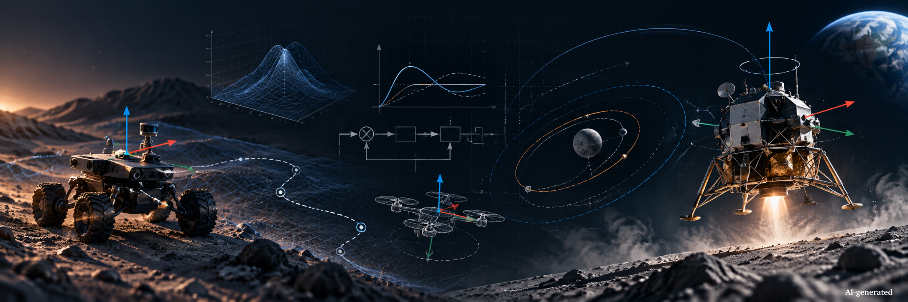

  

<h1 align="center">Gerd Schendzielorz</h1>

  <strong>Aerospace Engineer · C++ Developer · Simulation · Robotics · Control</strong>

  <em>Engineering physical systems through software.</em>

  
  
  
  
  

---

## About me

I am an **Aerospace Engineer (M.Sc.)** with a technical background in **dynamics, control engineering, robotics, autonomous systems and simulation**.

For me, software development started as an **engineering tool**.

During my aerospace engineering studies, I began using **C++ and ROS** to model, control and analyse real technical systems. My academic work included autonomous vehicles, robotic control systems, experimental RC platforms with indoor tracking, vehicle-control algorithms and engineering data analysis.

Over time, software engineering became an increasingly important part of my technical work. Today, I combine engineering fundamentals with modern software development to build simulation, analysis and control systems.

I currently serve as a **military officer** while continuing to deepen my engineering and software-development expertise, with the long-term goal of working professionally in engineering development, simulation, robotics and autonomous systems.

---

## Engineering → Software

My programming background grew directly out of engineering work.

During university, I worked on software-intensive projects involving:

- autonomous and robotic systems
- C++ and ROS-based applications
- closed-loop motion and attitude control
- experimental vehicle platforms and indoor tracking
- vehicle dynamics and control near physical limits
- engineering data analysis and visualisation
- simulation and numerical methods

My Master's work focused on **vehicle control near the dynamic limits**.

> **Software is not the objective by itself.  
> It is a tool for modelling, understanding and solving engineering problems.**

---

## Technical focus

<table>
<tr>
<td width="50%" valign="top">

### Engineering

- Aerospace Engineering
- Rigid-Body Dynamics
- Flight & Space Dynamics
- Control Engineering
- Robotics
- Autonomous Systems
- Numerical Simulation
- Guidance, Navigation & Control

</td>
<td width="50%" valign="top">

### Software

- C++17 / C++20
- Qt 6
- CMake
- Eigen
- ROS / ROS 2
- Python
- Git / GitHub
- XML / JSON
- SQLite

</td>
</tr>
</table>

---

## Selected engineering projects

### 🚀 Spaceflight Dynamics Framework

An open-source C++ framework for spacecraft dynamics, simulation, propulsion, guidance, navigation and control.

`6-DoF Dynamics` · `Rigid-Body Simulation` · `GNC` · `Qt` · `C++` · `Testing`

➡️ **[Explore the Spaceflight Dynamics Framework](https://github.com/gerd-lrt-dev/spaceflight-dynamics-framework)**

### 🛣️ OpenDrive Analyzer

A C++ / Qt engineering application for parsing, analysing and visualising OpenDRIVE road-network data.

`C++17` · `Qt` · `TinyXML2` · `SQLite` · `CMake`

---

## Why I build open-source engineering software

I want my development work to provide value beyond a single project.

My goal is to create software, documentation and engineering examples that can support:

- students learning simulation and engineering software
- researchers experimenting with physical models and control algorithms
- engineers interested in scientific computing
- developers entering robotics, aerospace or simulation
- technically curious people who want to understand how physical systems can be represented in software

I particularly enjoy projects where **physics, mathematics and software architecture meet**.

---

## Collaboration

I am interested in collaboration around:

`Simulation` · `C++` · `Robotics` · `Control` · `GNC` · `Numerical Methods`

Contributions do not have to be limited to source code. Validation, physical modelling, testing, documentation, numerical methods and engineering discussions are equally valuable.

If you find one of my projects interesting, feel free to open an issue, start a discussion or contribute.

---

## Find me

  <a href="https://www.aerospace-simulation.dev"><strong>🌍 aerospace-simulation.dev</strong></a>
  &nbsp;&nbsp;•&nbsp;&nbsp;
  <a href="https://github.com/gerd-lrt-dev"><strong>GitHub</strong></a>

  Engineering · Simulation · Software

